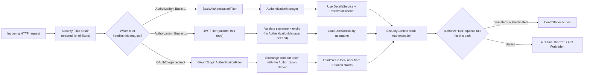
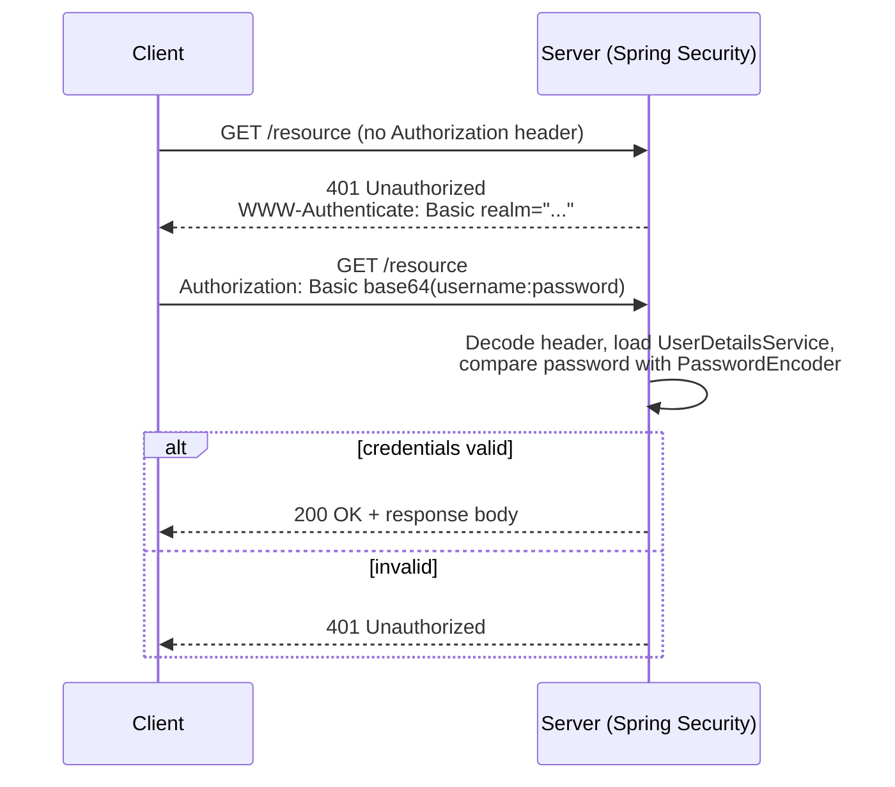
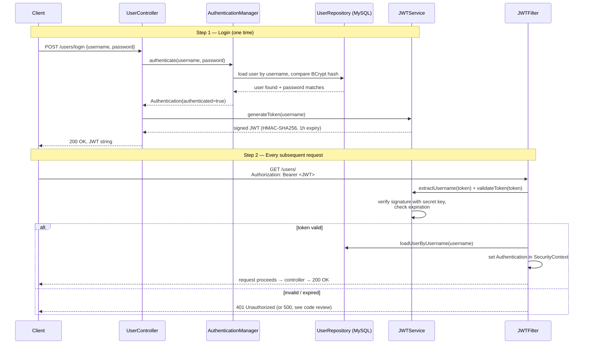
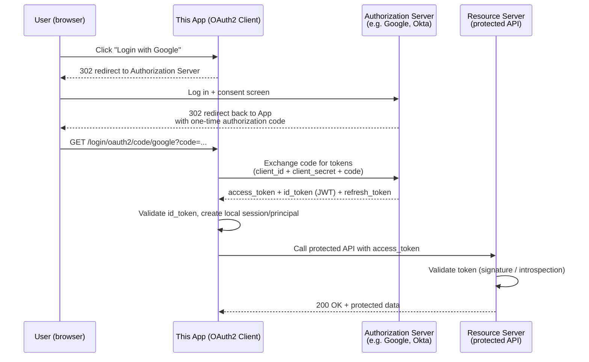

# Spring Security Demo (JWT + DAO Authentication)

A small Spring Boot project demonstrating stateless authentication with Spring Security, a custom `UserDetailsService` backed by JPA/MySQL, and JWT-based session-free auth. Built as a learning/reference project, not production-ready (see [Code Review](#code-review) below).

## Tech Stack

- Java 19, Spring Boot 3.5.3
- Spring Security (DAO authentication provider + custom JWT filter)
- Spring Data JPA + MySQL
- `jjwt` 0.11.5 (JSON Web Tokens)
- Maven (wrapper included)

## Project Structure

```
src/main/java/com/example/spring/security/demo/
├── SpringSecurityDemoApplication.java   # entry point
├── HelloController.java                 # /public, /private demo endpoints
├── config/
│   ├── SecurityConfig.java              # filter chain, auth provider, bcrypt
│   └── JWTFilter.java                   # extracts + validates Bearer token per request
├── controller/
│   ├── UserController.java              # /users/save, /users/login, /users/get_all, ...
│   └── StudentController.java           # unrelated in-memory demo CRUD (no auth)
├── dto/UserPrinciple.java               # UserDetails wrapper around the User entity
├── entity/{User,Student}.java
├── repository/UserRepository.java
└── service/
    ├── JWTService.java                  # token generation/validation
    ├── MyUserDetails.java               # UserDetailsService implementation
    └── UserService.java                 # registration + login/verify
```

## How It Works

1. `POST /users/save` registers a user; the password is BCrypt-hashed (strength 12) before being persisted.
2. `POST /users/login` authenticates the submitted credentials via `AuthenticationManager` → `DaoAuthenticationProvider`, and on success returns a signed JWT (1 hour expiry).
3. Every subsequent request passes the token as `Authorization: Bearer <token>`. `JWTFilter` extracts the username, loads the user via `MyUserDetails`, validates the token, and populates the `SecurityContext` — no server-side session (`SessionCreationPolicy.STATELESS`).

## Security Concepts & Flow Diagrams

Spring Security sits in front of every request as a **chain of servlet filters**. Each filter gets a chance to inspect the request, and eventually one of them decides *who* the caller is and writes an `Authentication` object into the `SecurityContext`. Everything downstream (`@PreAuthorize`, `.authorizeHttpRequests(...)`, your controller) just reads that context — it doesn't care whether the caller proved their identity with a password, a token, or a redirect to Google.



The three boxes on the left (Basic, JWT, OAuth2) are three different ways to answer the same question — "who is calling?" — with different tradeoffs. This repo implements **JWT** (and, currently, also leaves **Basic Auth** wired in — see the [code review](#code-review) note on that). **OAuth2 is not implemented here**; it's explained below for comparison since it's the natural next step from JWT.

### 1. HTTP Basic Authentication

The oldest, simplest scheme: credentials are sent on *every single request*, base64-encoded (not encrypted — base64 is trivially reversible) inside the `Authorization` header.



**Tradeoffs:** no separate login step, no token to manage — but the raw password is retransmitted on *every* call, there's no built-in expiry, and it only works safely over HTTPS. Fine for service-to-service calls or quick demos; not something you'd want a browser SPA doing on every request.

### 2. JWT (what this repo implements)

Login happens **once**; the server hands back a signed, self-contained token that proves identity for a limited time, with no server-side session to store.



**Tradeoffs:** stateless (no session storage, scales horizontally), the token itself carries identity/claims, and it naturally expires. The cost is that a JWT **can't be revoked** before it expires (no server-side session to delete) unless you add a blocklist, and the signing secret becomes a single point of failure — which is exactly the bug flagged in [Code Review § High](#-high--functionalsecurity-bugs): this repo currently generates a *new* secret on every restart instead of using a fixed one.

### 3. OAuth2 / OpenID Connect (not implemented in this repo)

OAuth2 solves a different problem than Basic/JWT: **delegated login**, where your app never sees the user's password at all — it trusts a third-party Authorization Server (Google, GitHub, Okta, Keycloak, ...) to authenticate the user and hand back a token. This is what Spring Security's `spring-boot-starter-oauth2-client` / `spring-boot-starter-oauth2-resource-server` add-ons are for.

> A working example of this flow (`spring-boot-starter-oauth2-client`, "Login with Google/GitHub"-style) lives in a separate companion repo: [temptation4/springboot-oauth2-login](https://github.com/temptation4/springboot-oauth2-login).



**Tradeoffs:** the app never handles or stores raw passwords, users get single sign-on and MFA "for free" from the provider, and tokens can be scoped/revoked centrally — but it adds real complexity (redirect flows, client registration, token refresh) and a hard dependency on the external Authorization Server being reachable. It's the right choice when you want "Sign in with Google/GitHub" or centralized SSO across multiple services; it's overkill for a single internal API with its own user table, which is why this demo uses plain JWT instead.

### Quick comparison

| | HTTP Basic | JWT (this repo) | OAuth2 / OIDC |
|---|---|---|---|
| Credentials sent to your server | Every request | Once, at login | Never (delegated to Authorization Server) |
| Server-side session state | None | None (stateless) | Depends on client config |
| Built-in expiry | No | Yes (`exp` claim) | Yes (access + refresh tokens) |
| Revocation before expiry | N/A (no token) | Hard (needs a blocklist) | Easier (provider can revoke centrally) |
| Typical use case | service-to-service, quick demos | first-party API + first-party client | "Login with X", multi-service SSO |
| Used in this repo | Wired in but not the intended flow (see review) | ✅ Primary mechanism | ❌ Not implemented |

## Running Locally

Requires a local MySQL instance with a `testdb` database (see [Configuration](#configuration) — the checked-in credentials are placeholders you should change).

```bash
./mvnw spring-boot:run
```

The app starts on port `8082`.

### Example requests

```bash
# Register
curl -X POST http://localhost:8082/users/save \
  -H "Content-Type: application/json" \
  -d '{"username":"alice","password":"secret","role":"USER"}'

# Login (returns a JWT string)
curl -X POST http://localhost:8082/users/login \
  -H "Content-Type: application/json" \
  -d '{"username":"alice","password":"secret"}'

# Call a protected endpoint
curl http://localhost:8082/users/ -H "Authorization: Bearer <token>"
```

## Configuration

Database and app settings live in `src/main/resources/application.yml`. Before running this yourself, replace the datasource credentials and do not commit real ones — see the security findings below.

---

## Code Review

This review covers the state of the repository as cloned from `github.com/temptation4/spring-security-demo-in-details`. Findings are ordered by severity.

### 🔴 Critical — rotate/remove immediately

- **A private SSH key is committed to the repo** (`git init`, an OpenSSH private key, paired with the public key in `git init.pub`, associated with `neelhuma@gmail.com`). Because this repo is public, **this key must be treated as compromised**: revoke/remove it from every place it's authorized (GitHub deploy keys, servers' `authorized_keys`, etc.), generate a new key pair, and purge both files from git history (`git filter-repo` or BFG — removing the file from HEAD is not enough, it's still in every prior commit). This is the single most important fix in this repo.
- **Hardcoded database credentials** in `src/main/resources/application.yml` (`root` / `password` for a local MySQL instance) and a **hardcoded Spring Security fallback user** (`admin` / `admin123`). Even for a demo, real-looking credentials shouldn't be committed — use environment variables or a `.env`/`application-local.yml` that's gitignored, and rotate these values if they're reused anywhere real.
- **A live-looking JWT sample is pasted in a code comment** in `JWTFilter.java:30`. It's almost certainly expired by now, but committing real tokens (even test ones) to source control is a bad habit worth breaking.

### 🟠 High — functional/security bugs

- **JWT signing key is regenerated on every application restart** (`JWTService` constructor calls `KeyGenerator.generateKey()` each time the bean is created, instead of loading a fixed secret). Every token becomes invalid the moment the app restarts, and tokens issued by one instance won't validate on another — this breaks JWT auth entirely in any restart or multi-instance deployment. The secret should come from configuration (env var / secrets manager), not be generated at runtime.
- **No role-based authorization is actually enforced.** `SecurityConfig` only distinguishes "permit all" vs "authenticated" (`.anyRequest().authenticated()`); there's no `.hasRole(...)`. So `GET /users/admin` and `GET /users/user` are both reachable by any authenticated user regardless of their `role` — the role field on `User` and the hardcoded `"role": "ADMIN"` claim in `JWTService.generateToken` are effectively decorative.
- **Privilege escalation on registration.** `POST /users/save` binds the request body directly to the `User` entity, including `role`. Any caller can register themselves with `"role":"ADMIN"`. Registration should use a separate DTO that excludes `role` (or ignores/overrides client-supplied roles server-side).
- **Password hashes leak via the API.** `GET /users/get_all` returns the full `User` entity list, including the BCrypt `password` field, to any authenticated caller. Add a response DTO or `@JsonIgnore` the password.
- **`/public` isn't actually public.** `HelloController`'s `/public` endpoint is not in the `permitAll()` list in `SecurityConfig`, so it requires authentication despite its name — likely a bug, not intentional.

### 🟡 Medium

- **Stateless config contradicted by session usage.** `SecurityConfig` sets `SessionCreationPolicy.STATELESS`, but `HelloController.publicEndpoint` calls `httpRequest.getSession().getId()`, which creates an HTTP session anyway and leaks its ID in the response.
- **Both HTTP Basic and JWT are wired into the same filter chain** (`httpBasic(Customizer.withDefaults())` alongside the `JWTFilter`). It's unclear which is the intended auth mechanism; having both active is confusing and widens the attack surface for no benefit — pick one (JWT) and drop `httpBasic`.
- **`spring-boot-starter-web-services` instead of `spring-boot-starter-web`.** `web-services` is meant for SOAP endpoints; a REST-only app like this should depend on `spring-boot-starter-web`. It happens to work here (something transitively pulls in an embedded server), but it's the wrong dependency for the stated purpose.
- **No input validation** on request bodies (`@Valid` / Bean Validation annotations on `User`) — empty/blank usernames or passwords are accepted.
- **No centralized error handling.** A failed login returns the plain string `"Failure"` with HTTP 200 instead of a 401; an invalid/expired JWT will surface as an unhandled exception (raw 500) rather than a clean 401/403. A `@ControllerAdvice` would clean this up.
- **`ddl-auto: update` and `show-sql: true`** are fine for local demo use but shouldn't be the default in anything resembling a real environment — call this out if the project ever grows beyond a demo.

### 🟢 Low / cosmetic

- Java 19 is targeted; 17 and 21 are the current LTS releases — consider moving to one of those for a longer support window.
- `StudentController`/`Student` is unrelated in-memory demo CRUD with no auth at all — fine as a scratch example, but it dilutes the "security demo" focus of the repo and might confuse a reader looking for security-relevant code.
- `pom.xml` has empty `<url/>`, `<license/>`, `<developer/>`, `<scm>` blocks — harmless but can be trimmed or filled in.
- A stray empty directory (`SpringSecurityUserDetailsService/`) exists at the repo root with no contents — looks like a leftover from a rename/refactor and can likely be deleted.
- Root-level `README.md` (before this review) just contained the title `spring-security-jwt-auth`, mismatched with this repo's actual name (`spring-security-demo-in-details`) — worth double-checking that title wasn't copy-pasted from a sibling project.

### Summary

The auth *flow* (register → BCrypt hash → login → JWT → stateless filter validation) is structured correctly and is a reasonable reference for how the pieces fit together. The two things worth fixing before this repo is used for anything beyond reading code: **rotate the exposed SSH key and scrub it from git history**, and **fix the JWT secret to be stable across restarts** — everything else is demo-quality polish.
